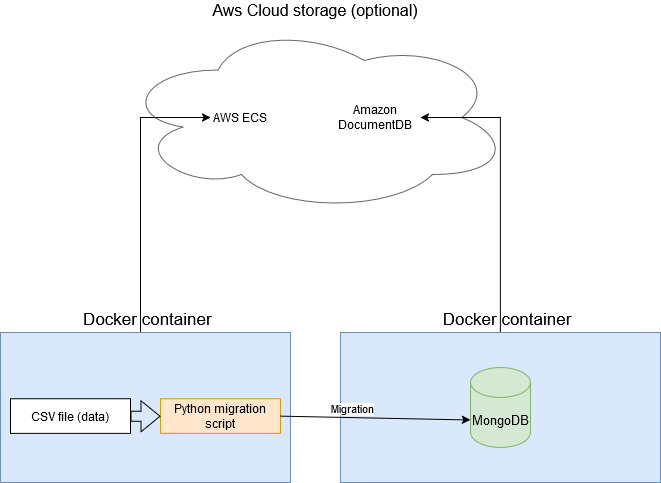

# Migration-MongoDB
Migration données médicales vers MongoDB, effectué en python, Conteneurisé dans Docker




## Prérequis Python

- Python 3.x installé
- MongoDB en cours d'exécution (par défaut sur `localhost:27017`)
- Les bibliothèques suivantes installées :
  - `pandas`
  - `pymongo`

Exemple d'installation dans le command prompt avec la commande :

```bash
pip install pandas pymongo
```

Pour lancer la migration et tester qu'elle fonctionne bien :

Toutes les commandes qui suivent sont à lancer à la racine du projet :
### Lancer le script :
```bash
python scripts/migration.py
```
```bash
2024-12-13 00:17:24,939 - INFO - Script started.
2024-12-13 00:17:25,238 - INFO - Dataset loaded with 55500 rows and 15 columns.
2024-12-13 00:17:25,382 - INFO - Attempting to connect to MongoDB at mongodb://localhost:27017/
2024-12-13 00:17:25,391 - INFO - Successfully connected to MongoDB server.
2024-12-13 00:17:25,392 - INFO - Database 'healthcare_dataset' and collection 'healthcare' selected successfully.
2024-12-13 00:17:25,545 - INFO - Indexes created for primary key ['Name', 'Date_of_Admission'] and additional fields ['Medical_Condition', 'Doctor', 'Hospital'].
2024-12-13 00:17:28,753 - INFO - 50000 documents inserted into the collection.
2024-12-13 00:17:28,779 - INFO - Script ended.
```

### Lancer les tests :
```bash
python pytest tests/ --verbose
```
```bash
=========================================================================================================== test session starts ============================================================================================================
platform win32 -- Python 3.12.8, pytest-8.3.3, pluggy-1.5.0 -- ...\PythonSoftwareFoundation.Python.3.12_qbz5n2kfra8p0\python.exe
cachedir: .pytest_cache
rootdir: ...
configfile: pyproject.toml
collected 2 items

tests\migration_test.py::test_mongo_connection PASSED                                                                                                                                                                                 [ 50%]
tests\migration_test.py::test_data_integrity PASSED                                                                                                                                                                                   [100%]

============================================================================================================ 2 passed in 2.78s =============================================================================================================
```

## Prérequis Docker

- Docker installé. Si ce n'est pas le cas : suivre [le guide d'installation Docker](https://docs.docker.com/get-docker/)
- Docker Compose installé. Instructions [ici](https://docs.docker.com/compose/install/)

## Lancer l'application avec Docker

Follow these steps to run the application using Docker:

### 1. Construire l'image Docker 

```bash
docker-compose build
```

### 2. Lancer les conteneurs Docker

```bash
docker-compose up
```

### 3. Vérifier la Migration

Une fois que les conteneurs sont lancés, la base MongoDB deviennent accessible avec un client MongoDB tel que MongoDB Compass  
La base de donnée est nommée *healthcare_dataset*

### 4. Arreter les conteneurs Docker
```bash
docker-compose down
```


# Variables d'environnement :
Présentes dans un fichier à créer à la racine .env :
```python
# MongoDB connection details
MONGO_HOST=mongodb
MONGO_PORT=27017
MONGO_DB=healthcare_dataset

# MongoDB user credentials
MONGO_ADMIN_USER=admin_user
MONGO_ADMIN_PASS=admin_password
MONGO_DEV_USER=dev_user
MONGO_DEV_PASS=dev_password
MONGO_READER_USER=reader_user
MONGO_READER_PASS=reader_password
```

# Explication des roles :
AdminRole : role administrateur  
DevRole : role lecture écriture  
ReaderRole : role lecture  

# Problème possible :
Si Mongo est déjà en route, il peut rentrer en conflit avec docker, dans ce cas,lancer 
```bash
net stop MongoDB
```
pour arreter Mongo avant de lancer docker


# For testing purposes

To reset everything, do
```bash
docker-compose down --volumes
docker volume prune
docker rmi -f mongo
```
And then restart with
```bash
docker-compose up -d
```